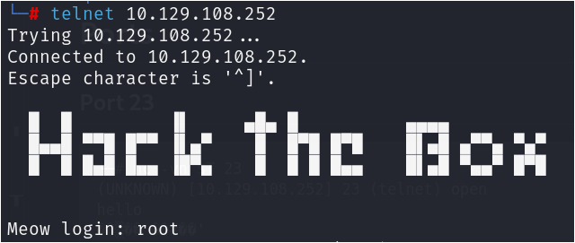
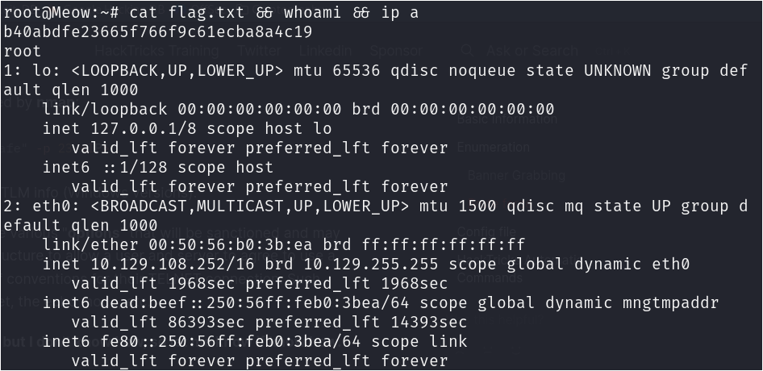

# Scenario Introduction


Hack The Box Starting Point Machine #1  
Target Machine: 10.129.108.252

# Summary
In this challenge, I was able to compromise a machine that had a misconfiguration that left it vulnerable with a Default Credentials attack.

# Reconnaissance
Since the IP Address of the host was already given to us, there is no need for a host discovery phase.

We can proceed to do a port scan for our target to figure out any open ports.
```bash
└─# nmap -A 10.129.108.252 -T5 -sS
Starting Nmap 7.94 ( https://nmap.org ) at 2024-04-01 19:50 PDT
Nmap scan report for 10.129.108.252
Host is up (0.19s latency).
Not shown: 999 closed tcp ports (reset)
PORT   STATE SERVICE VERSION
23/tcp open  telnet  Linux telnetd
Aggressive OS guesses: AXIS 210A or 211 Network Camera (Linux 2.6.17) (95%), Linux 3.1 (92%), Linux 3.2 (92%), Linux 5.0 (91%), Linux 4.15 - 5.8 (90%), Linux 5.4 (90%), ASUS RT-N56U WAP (Linux 3.4) (90%), Linux 3.16 (90%), Linux 5.3 - 5.4 (90%), Linux 2.6.32 (90%)
No exact OS matches for host (test conditions non-ideal).
Network Distance: 2 hops
Service Info: OS: Linux; CPE: cpe:/o:linux:linux_kernel

TRACEROUTE (using port 5900/tcp)
HOP RTT       ADDRESS
1   752.81 ms 10.10.14.1
2   752.84 ms 10.129.108.252

OS and Service detection performed. Please report any incorrect results at https://nmap.org/submit/ .
Nmap done: 1 IP address (1 host up) scanned in 29.99 seconds
```

# Initial Access
From our completed Nmap scan, we can see that port 23 Telnet is open.
We attempt to connect to the port using the telnet command. We are greeted with a banner and a prompt to login. With some OSINT, I ran into a list of default credentials and tried to login as root. Success!




# Privilege Escalation
There is no need for a privilege escalation phase as we have logged in as root.

# Flag


# Conclusion
Weak and Default Credentials remains to be an issue. As a remediation, I recommend having a password policy in place to prevent these types of issues in the future.

## References
- https://www.criticalstart.com/default-configurations-a-common-gateway-for-threat-actors/
- https://nvlpubs.nist.gov/nistpubs/SpecialPublications/NIST.SP.800-128.pdf


